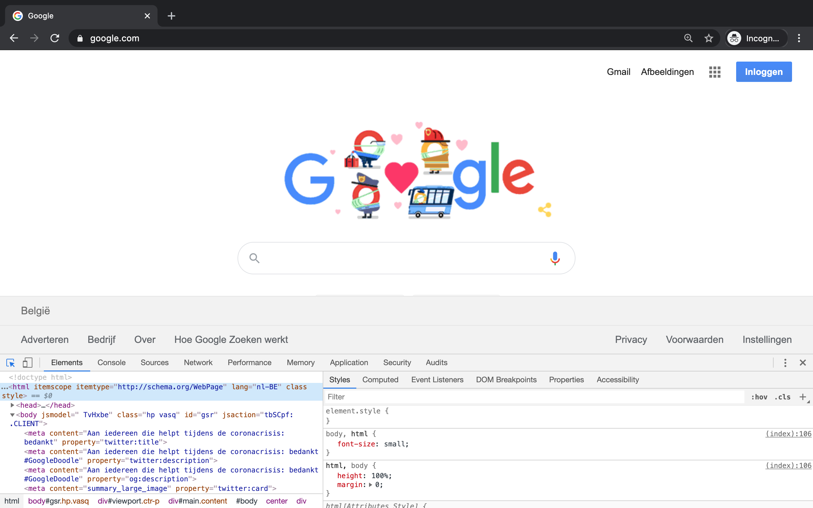
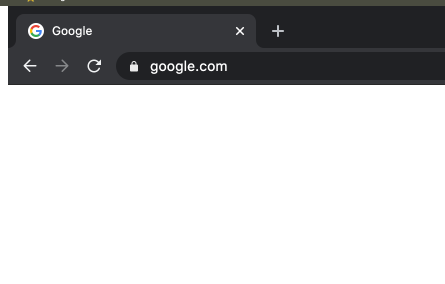

# Handleiding

## Code
De code voor deze scriptie is raadpleegbaar is de volgende github repository: http://github.com/...

```
.
├── README.md           = De handleiding
├── backend             = De 4 micro services die samen de backend vormen
│   ├── APIGateway
│   ├── CustomerService
│   ├── LogService
│   ├── ProductService
│   └── backend_architecture.drawio
├── docker-compose.yml  = Docker Compose instructies om containers op te zetten
├── frontend            = Alle frontend projecten
│   ├── angular-lit-elements
│   ├── custom-elements
│   ├── lit-elements
│   ├── react-baseline
│   ├── react-custom-elements
│   └── react-lit-elements
└── proxies             = De twee proxy servers
    ├── angular-proxy
    └── react-proxy
```

## Containers

De volgende tabellen beschrijven de containers en de geassocieerde poorten voor dit werkstuk.

### Backend

| Container| Project | Type | Port |
|----| ------ | ----- | ----- |
| gateway | backend/APIGateway | Java Spring Boot Microservice | 2003 |
| customer | backend/CustomerService | Java Spring Boot Microservice | 2000 |
| customer-db | CustomerService | MySQL datastore | 3306 |
| product | backend/ProductService | Java Spring Boot Microservice | 2001 |
| product-db | CustomerService | MongoDB datastore | 27017 |
| log-server | backend/LogService | Java Spring Boot Microservice | 2002 |
| log-db | CustomerService | InfluxDB datastore | 8086 |
| zookeeper | Apache Zookeeper | Consensustool | 2181 |
| kafka | Apache Kafka | Streamingsplatform | 9092 |

### Frontend 
| Container| Project | Type | Port |
|----| ------ | ----- | ----- |
| baseline | frontend/react-baseline | React | 3000 |
| custom | frontend/react-custom-elements | React + Web Components| 3001 |
| react | frontend/react-lit-elements | React + LitElement | 3002 |
| angular | frontend/angular-lit-elements | Angular + LitElement | 4200 |

### Proxies

| Container| Project | Type | Port |
|----| ------ | ----- | ----- |
| react-proxy | proxies/react-proxy | Express | 3010 |
| angular-proxy | proxies/angular-proxy | Express | 3011 |

# Stappen

1. Clone de code van http://github.com/...
2. Navigeer naar deze repository
3. In de root map van deze repository voer je het volgende commando uit:
> `Opmerking:` Er wordt gebruik gemaakt van Docker Compose, indien dit niet geïnstalleerd is op uw machine dient u deze stappen te volgen: https://docs.docker.com/compose/install/

> `Disclaimer: ` Deze stap vereist veel ruimte op uw machine en kan even duren.
```bash
docker-compose up
```
4. Wacht tot alle containers gestart zijn.
5. Navigeer naar http://localhost:3000 om het baseline React project te zien.
6. Navigeer naar http://localhost:3001 om het React + Web Components project te zien.
7. Navigeer naar http://localhost:3002 om het React + LitElement project te zien.
8. Navigeer naar http://localhost:3002 om het Angular + LitElement project te zien.
9. Navigeer naar http://localhost:3010 om het React + LitElement via zijn proxy te raadplegen
10. Navigeer naar http://localhost:3011 om het Angular + LitElement via zijn proxy te raadplegen


# HOE WEBCRAWLER SIMULEREN (TOON DIT IN CHROME DEVTOOLS)

## Open Google Chrome DevTools

1. Open Google Chrome
2. Op Mac: cmd + opt + C, op Windows: ctrl + shift + C

U krijgt het volgende te zien:



## Schakel Javascript uit

1. Op Mac: cmd + opt + P, op Windows: ctrl + shift + P
2. Voer hetvolgende in: "Disable JavaScript"
3. Druk op enter

## User-Agent string vervangen

1. Op Mac: cmd + opt + P, op Windows: ctrl + shift + P
2. Voer hetvolgende in: "Show Network conditions"
3. Druk op enter
4. Vink de "Select automatically"-optie bij de User agent sectie af
5. Selecteer Googlebot uit de lijst

## Cache verwijderen en harde pagina reload



1. Rechter muisknop op de cirkelvormige pijl
2. 
