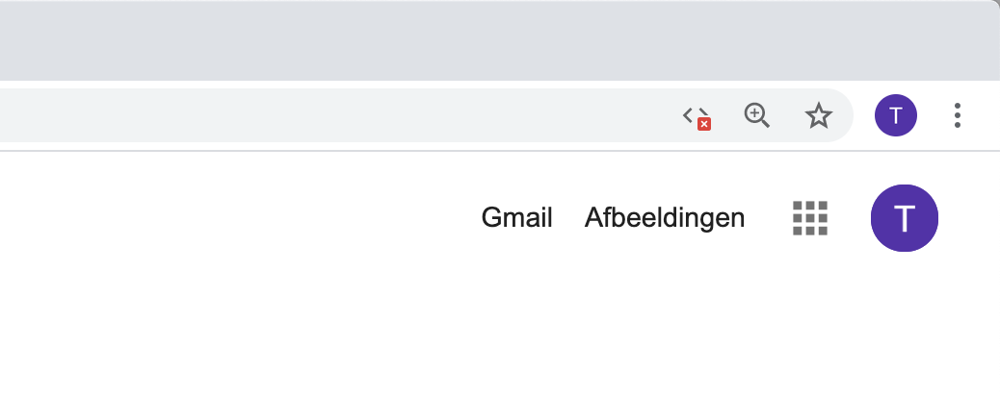

# Algemene handleiding

## Code

De code voor deze scriptie is raadpleegbaar is de volgende github repository: https://github.com/TimDeSmet/masterproef-public

## Structuur
```
.
├── README.md               = De handleiding
├── assets                  = De afbeeldingen voor de README.md
├── backend                 = De 4 micro services die samen de backend vormen
├── docker-compose.yml      = Docker Compose instructies om containers op te zetten
├── frontend                = Alle frontend projecten
├── html                    = Resulterende html antwoorden uit SEO-analyse
└── proxies                 = De twee proxy servers
```

## Containers

De volgende tabellen beschrijven de containers en de geassocieerde poorten voor dit werkstuk.

### Backend

| Container| Project | Type | Port |
|----| ------ | ----- | ----- |
| gateway | backend/APIGateway | Java Spring Boot Microservice | 2003 |
| customer | backend/CustomerService | Java Spring Boot Microservice | 2000 |
| customer-db | CustomerService | MySQL datastore | 3306 |
| product | backend/ProductService | Java Spring Boot Microservice | 2001 |
| product-db | CustomerService | MongoDB datastore | 27017 |
| log-server | backend/LogService | Java Spring Boot Microservice | 2002 |
| log-db | CustomerService | InfluxDB datastore | 8086 |
| zookeeper | Apache Zookeeper | Consensustool | 2181 |
| kafka | Apache Kafka | Streamingsplatform | 9092 |

### Frontend 
| Container| Project | Type | Port |
|----| ------ | ----- | ----- |
| baseline | frontend/react-baseline | React | 3000 |
| custom | frontend/react-custom-elements | React + Web Components| 3001 |
| react | frontend/react-lit-elements | React + LitElement | 3002 |
| angular | frontend/angular-lit-elements | Angular + LitElement | 4200 |
| pure | frontend/pure-with-web-components | HTML/JS + Web Components | 2998
| perf | frontend/pure-with-lit-elements | HTML/JS + LitElement | 2999

### Proxies

| Container| Project | Type | Port |
|----| ------ | ----- | ----- |
| react-proxy | proxies/react-proxy | Express | 3010 |
| angular-proxy | proxies/angular-proxy | Express | 3011 |

## Containers opstarten

1. Clone de code van https://github.com/TimDeSmet/masterproef-public
```
$ git clone https://github.com/TimDeSmet/masterproef-public
```
2. Navigeer naar deze repository
3. In de root map van deze repository voer je het volgende commando uit:
> `Opmerking:` Er wordt gebruik gemaakt van Docker Compose, indien dit niet geïnstalleerd is op uw machine dient u deze stappen te volgen: https://docs.docker.com/compose/install/

> `Opmerking: ` Deze stap vereist heel wat geheugenruimte op uw machine om te kunnen slagen. 
```bash
docker-compose up
```
4. Wacht tot alle containers gestart zijn.
> `Opmerking:` De containers zijn pas echt opgestart eens het loggen uitdooft.
5. Navigeer naar http://localhost:3000 om het baseline React project te zien.
6. Navigeer naar http://localhost:3001 om het React + Web Components project te zien.
7. Navigeer naar http://localhost:3002 om het React + LitElement project te zien.
8. Navigeer naar http://localhost:4200 om het Angular + LitElement project te zien.
9. Navigeer naar http://localhost:3010 om het React + LitElement project via zijn proxy te raadplegen.
10. Navigeer naar http://localhost:3011 om het Angular + LitElement project via zijn proxy te raadplegen.
11. Navigeer naar http://localhost:2998 om het HTML/JS + Web Component project te zien.
12. Navigeer naar http://localhost:2999 om het HTML/JS + LitElement project te zien. 


# Handleiding experiment

## Openen van Google Chrome DevTools

Voer de volgende stappen uit om de DevTools van Google Chrome te kunnen gebruiken:

1. Open Google Chrome 
2. Voer de volgende toetsencombinatie uit 
    - Mac: Command+Shift+C
    - Windows: Control+Shift+C
3. De DevTools zijn nu zichtbaar:


## Uitschakelen van JavaScript

1. Voer de stappen uit de vorige sectie uit.
2. Klik eender waar in het DevTools paneel.
3. Voer de volgende toetsencombinatie uit:
    - Mac: Command+Shift+P
    - Windows: Control+Shift+P
4. Geef het volgende in: "Disable Javascript".
5. Druk op enter.
6. JavaScript is uitgeschakelt:



## User-Agent string vervangen

1. Open opnieuw de Google Chrome DevTools
2. Klik eender waar in het DevTools paneel.
3. Voer de volgende toetsencombinatie uit:
    - Mac: Command+Shift+P
    - Windows: Control+Shift+P
4. Geef het volgende in: "Show Network conditions".
5. Druk op enter.
6. Vink de "Select automatically"-optie bij de User Agent-sectie af.
7. Selecteer Googlebot uit de lijst.


## Cache verwijderen en harde pagina reload


1. Open opnieuw de Google Chrome DevTools
2. Rechterklik links bovenaan de pagina op de reload knop (ronde pijl).
3. Selecteer de optie: "Cache wissen en geforceerd opnieuw laden".


